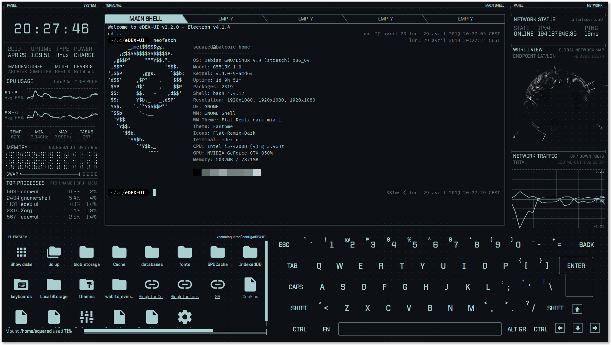
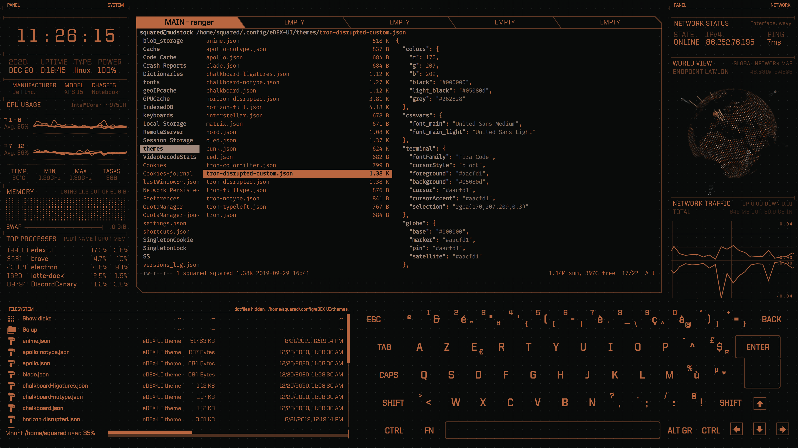
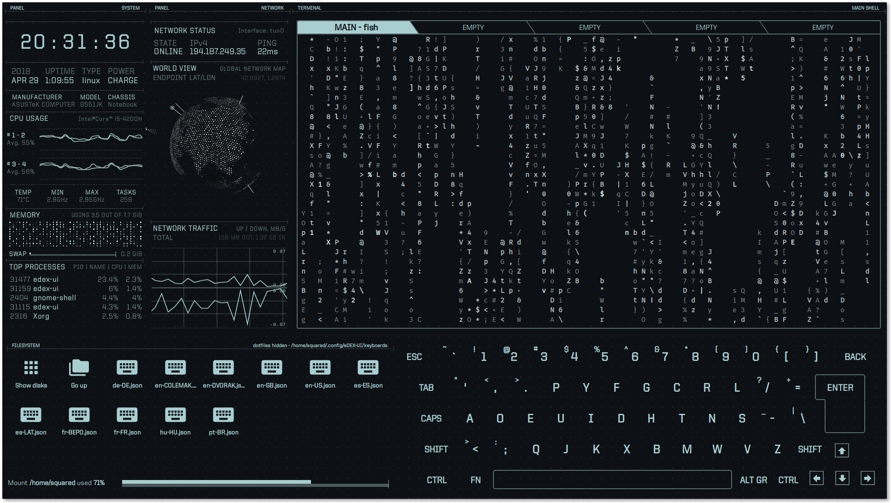
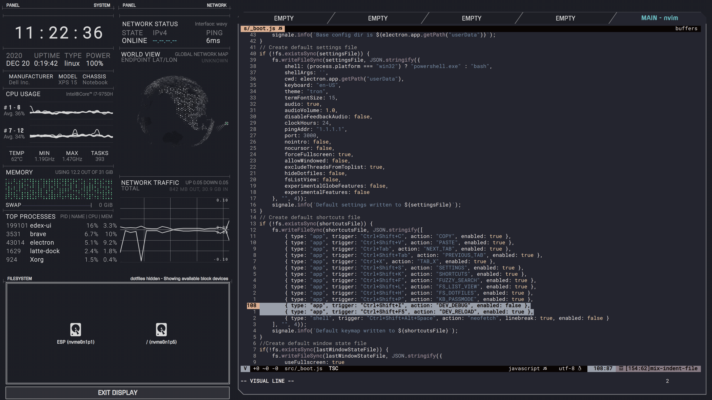
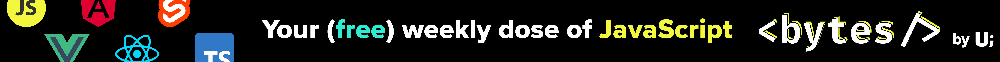

<p align="center">
  <br>
  
  <br><br>
  <a href="https://github.com/GitSquared/edex-ui/releases/latest"></a>
  <a href="https://github.com/GitSquared/edex-ui/releases"></a>
  <a href="https://github.com/GitSquared/edex-ui/blob/master/LICENSE"></a>
  <a href="https://lgtm.com/projects/g/GitSquared/edex-ui/context:javascript"></a>
  <br>
  <a href="https://github.com/GitSquared/edex-ui/releases/download/v2.2.8/eDEX-UI-Windows.exe"></a>
  <a href="https://github.com/GitSquared/edex-ui/releases/download/v2.2.8/eDEX-UI-macOS.dmg"></a>
  <a href="https://github.com/GitSquared/edex-ui/releases/download/v2.2.8/eDEX-UI-Linux-x86_64.AppImage"></a>
  <a href="https://github.com/GitSquared/edex-ui/releases/download/v2.2.8/eDEX-UI-Linux-arm64.AppImage"></a>
  <a href="https://aur.archlinux.org/packages/edex-ui"></a>
  <br>
  <a href="https://github.com/GitSquared/edex-ui/releases/tag/v2.2.8"><strong><i>(Projet archivé le 18 octobre 2021 — v2.2.8)</i></strong></a>
</p>

<br>

> **eDEX-UI** est un émulateur de terminal et moniteur système **plein écran**, **cross-platform**, conçu pour ressembler à une interface d'ordinateur de science-fiction.

<p align="center">
  <a href="https://youtu.be/BGeY1rK19zA">
    
  </a>
</p>

Lourdement inspiré des effets visuels du film [TRON: Legacy](https://web.archive.org/web/20170511000410/http://jtnimoy.com/blogs/projects/14881671) (notamment la [scène du conseil d'administration](https://gmunk.com/TRON-Board-Room)), le projet eDEX-UI était à l'origine conçu comme *« DEX-UI avec moins d'« art » et plus de « logiciel distribuable » »*.

Tout en conservant une esthétique futuriste, il s'efforce de maintenir un certain niveau de fonctionnalité et d'être utilisable dans des scénarios réels, avec l'objectif plus large d'amener les UX de science-fiction dans le grand public.

> ⚠️ *Ce projet a été archivé en octobre 2021 après 3 ans de développement actif. Il n'est plus maintenu.*

---

## Table des matières

- [Fonctionnalités](#fonctionnalités)
- [Architecture technique](#architecture-technique)
- [Captures d'écran](#captures-décran)
- [Installation](#installation)
- [Utilisation](#utilisation)
- [Développement](#développement)
- [Personnalisation](#personnalisation)
- [Questions & Réponses](#questions--réponses)
- [Sponsor](#sponsor)
- [Presse & Médiatisation](#presse--médiatisation)
- [Crédits](#crédits)
- [Licence](#licence)

---

## Fonctionnalités

| Domaine | Détail |
|---|---|
| **Terminal** | Émulateur complet avec **tabs**, couleurs 256, événements souris, support `curses`, rendu **WebGL** (xterm.js), ligatures de polices |
| **Monitoring CPU** | Courbes temps réel, fréquence, température, charge par cœur, usage des processus |
| **Monitoring RAM** | Graphe d'utilisation mémoire vive + swap avec historique lissé (SmoothieCharts) |
| **Monitoring réseau** | **Globe 3D** des connexions GeoIP, table des connexions actives, courbes de transfert entrant/sortant |
| **Clavier tactile** | Clavier virtuel complet avec **plusieurs layouts** (QWERTY, AZERTY, DVORAK...), mode « mot de passe » pour la confidentialité |
| **Explorateur de fichiers** | Affiche le contenu du dossier courant suivant le CWD du terminal ; vue grille ou liste |
| **Personnalisation** | **Thèmes JSON** (couleurs, polices, CSS injecté), layouts de clavier, polices personnalisées |
| **Multi-écrans** | Support des configurations multi-moniteurs |
| **Raccourcis** | Raccourcis clavier globaux entièrement customisables (fichier `shortcuts.json`) |
| **Effets sonores** | Ambiance sonore optionnelle composée par un designer sonore (IceWolf) |
| **Tactile** | Support complet des écrans tactiles |

---

## Architecture technique

eDEX-UI est construit sur **Electron 12** avec **Node.js** et du **JavaScript vanilla** (sans framework front-end).

### Structure globale

```
edex-ui/
├── src/
│   ├── _boot.js              # Processus principal Electron
│   ├── _renderer.js           # Processus renderer (UI)
│   ├── _multithread.js        # Cluster multi-thread pour systeminformation
│   ├── ui.html                # Point d'entrée HTML
│   ├── package.json           # Dépendances applicatives
│   ├── classes/               # 18 modules fonctionnels
│   │   ├── terminal.class.js  # Client/serveur terminal (xterm.js + node-pty)
│   │   ├── sysinfo.class.js   # Informations système (OS, kernel, uptime)
│   │   ├── netstat.class.js   # Statistiques réseau
│   │   ├── locationGlobe.class.js # Globe 3D des connexions
│   │   ├── keyboard.class.js  # Clavier tactile
│   │   ├── filesystem.class.js # Explorateur de fichiers
│   │   ├── cpuinfo.class.js   # Détails CPU
│   │   ├── ramwatcher.class.js # Graphique mémoire
│   │   ├── toplist.class.js   # Liste des processus
│   │   ├── conninfo.class.js  # Infos connexion réseau
│   │   ├── hardwareInspector.class.js # Inspection matériel
│   │   ├── clock.class.js     # Horloge
│   │   ├── mediaPlayer.class.js # Lecteur audio
│   │   ├── docReader.class.js # Lecteur de documents (PDF)
│   │   ├── modal.class.js     # Fenêtre modale
│   │   ├── fuzzyFinder.class.js # Recherche floue
│   │   ├── audiofx.class.js   # Gestion des effets sonores
│   │   └── updateChecker.class.js # Vérification de mises à jour
│   ├── assets/
│   │   ├── themes/            # 15 thèmes JSON (tron, blade, matrix, nord, etc.)
│   │   ├── css/               # 19 feuilles de style modulaires
│   │   ├── audio/             # 13 effets sonores WAV
│   │   └── misc/              # Log de boot, correspondance icônes fichiers
│   └── package.json
├── media/                     # Logo, icônes, captures d'écran
├── prebuild-minify.js         # Minificateur de build
└── file-icons-generator.js    # Générateur d'icônes de fichiers
```

### Flux de communication

```
                    ┌─────────────────────────┐
                    │   Processus Principal   │
                    │      (_boot.js)         │
                    │                         │
                    │  ┌───────────────────┐  │
                    │  │  Terminal Server  │  │
                    │  │  (node-pty x n)   │  │
                    │  └────────┬──────────┘  │
                    │           │ WebSocket    │
                    │  ┌────────▼──────────┐  │
                    │  │ Multi-thread       │  │
                    │  │ (_multithread.js)  │  │
                    │  │ Cluster CPU - 1    │  │
                    │  └────────┬──────────┘  │
                    └───────────┼──────────────┘
                                │ IPC
                    ┌───────────┼──────────────┐
                    │  Renderer (_renderer.js) │
                    │  ┌────────▼──────────┐   │
                    │  │  xterm.js Client  │   │
                    │  │  (5 tabs max)     │   │
                    │  ├───────────────────┤   │
                    │  │  Modules UI       │   │
                    │  │  (18 classes)     │   │
                    │  └───────────────────┘   │
                    └─────────────────────────┘
```

### Technologies clés

| Technologie | Rôle |
|---|---|
| **[Electron](https://www.electronjs.org/)** v12 | Framework desktop cross-platform |
| **[xterm.js](https://xtermjs.org/)** v4 | Émulateur de terminal côté client |
| **[node-pty](https://github.com/microsoft/node-pty)** v0.10 | Fork de processus terminal (pseudo-terminal) |
| **[systeminformation](https://systeminformation.io/)** v5 | Métriques système (CPU, RAM, réseau, processus) |
| **[SmoothieCharts](https://github.com/joewalnes/smoothie)** | Graphiques temps réel lissés |
| **[Howler.js](https://howlerjs.com/)** v2 | Lecture des effets sonores |
| **[maxmind](https://github.com/runk/node-maxmind)** + **geolite2** | Géolocalisation IP |
| **[augmented-ui](https://augmented-ui.com/)** | Bordures style sci-fi (bords clippés) |
| **[pdfjs-dist](https://mozilla.github.io/pdf.js/)** | Lecteur PDF intégré |

---

## Captures d'écran


*neofetch sur eDEX-UI 2.2 avec le thème "tron" et clavier QWERTY*


*Navigation dans les thèmes avec ranger sur le thème "blade"*


*cmatrix sur le thème expérimental "tron-disrupted" et clavier DVORAK*


*Édition du code source avec nvim sur le thème custom "horizon-full"*

---

## Installation

### Binaires pré-construits

| Plateforme | Architecture | Lien |
|---|---|---|
| **Windows** | x64 / ia32 | [Télécharger](https://github.com/GitSquared/edex-ui/releases/download/v2.2.8/eDEX-UI-Windows.exe) |
| **macOS** | x64 | [Télécharger](https://github.com/GitSquared/edex-ui/releases/download/v2.2.8/eDEX-UI-macOS.dmg) |
| **Linux** | x86_64 | [Télécharger](https://github.com/GitSquared/edex-ui/releases/download/v2.2.8/eDEX-UI-Linux-x86_64.AppImage) |
| **Linux** | ARM64 | [Télécharger](https://github.com/GitSquared/edex-ui/releases/download/v2.2.8/eDEX-UI-Linux-arm64.AppImage) |

Les binaires publics ne sont **pas signés** ([pourquoi ?](https://gaby.dev/posts/code-signing)). Sur Linux, il faut `chmod +x` le fichier AppImage avant de l'exécuter.

### Gestionnaires de paquets

- **Arch Linux** : [`edex-ui`](https://aur.archlinux.org/packages/edex-ui) (AUR)
- **macOS** : `brew install --cask edex-ui` (Homebrew)

### Depuis les sources

Voir la section [Développement](#développement).

---

## Utilisation

### Raccourcis clavier par défaut

| Raccourci | Action |
|---|---|
| `Ctrl+Shift+C` | Copier la sélection du terminal |
| `Ctrl+Shift+V` | Coller dans le terminal |
| `Ctrl+Tab` / `Ctrl+Shift+Tab` | Tab suivant / précédent |
| `Ctrl+1` à `Ctrl+5` | Basculer vers le tab N |
| `Ctrl+Shift+S` | Ouvrir les paramètres |
| `Ctrl+Shift+K` | Aide des raccourcis clavier |
| `Ctrl+Shift+F` | Recherche floue dans le dossier courant |
| `Ctrl+Shift+P` | Mode « mot de passe » du clavier tactile |
| `Ctrl+Shift+L` | Basculer vue grille / liste du navigateur |
| `Ctrl+Shift+H` | Afficher/masquer les fichiers cachés |
| `F11` | Mode fenêtré (si activé dans les paramètres) |
| `Alt+F4` (Windows) | Quitter l'application |

### Paramètres

Ouvrir les paramètres avec `Ctrl+Shift+S` pour modifier :
- Le shell (bash, zsh, powershell...)
- Le thème et la police du terminal
- Le layout du clavier tactile
- Le volume audio
- Le port de communication WebSocket
- Le moniteur cible

---

## Développement

### Prérequis

- **Node.js** 14+
- **Python** 2.7 ou 3.x (pour la compilation des modules natifs)
- **Build tools** :
  - Windows : `windows-build-tools` (VS C++ Build Tools)
  - Linux : `build-essential`, `libx11-dev`, `libxkbfile-dev`
  - macOS : Xcode Command Line Tools

### Démarrage rapide

```bash
git clone https://github.com/GitSquared/edex-ui.git
cd edex-ui
```

**Windows** (en tant qu'administrateur) :
```powershell
npm run install-windows
npm run start
```

**Linux / macOS** :
```bash
npm run install-linux
npm run start
```

### Build

```bash
npm install
npm run build-linux      # ou build-windows / build-darwin
```

Les scripts de build minifient le code source, recompilent les dépendances natives et génèrent les livrables dans le dossier `dist`.

> ⚠️ Les modules natifs (`node-pty`, `osx-temperature-sensor`) imposent de builder uniquement pour le système hôte.

### Versions nightly

Des binaires pré-construits de la dernière version en développement sont disponibles via [GitHub Actions](https://github.com/GitSquared/edex-ui/actions) (onglet `Artifacts`).

---

## Personnalisation

### Thèmes

Les thèmes sont des fichiers **JSON** situés dans le dossier de configuration :
- Windows : `%APPDATA%/eDEX-UI/themes/`
- macOS : `~/Library/Application Support/eDEX-UI/themes/`
- Linux : `~/.config/eDEX-UI/themes/`

**Structure d'un thème :**

```json
{
    "colors": {
        "r": 170, "g": 207, "b": 209,
        "black": "#000000",
        "light_black": "#05080d",
        "grey": "#262828"
    },
    "cssvars": {
        "font_main": "United Sans Medium",
        "font_main_light": "United Sans Light"
    },
    "terminal": {
        "fontFamily": "Fira Mono",
        "cursorStyle": "block",
        "foreground": "#aacfd1",
        "background": "#05080d",
        "selection": "rgba(170,207,209,0.3)"
    },
    "globe": {
        "base": "#000000",
        "marker": "#aacfd1",
        "pin": "#aacfd1",
        "satellite": "#aacfd1"
    }
}
```

La propriété `injectCSS` permet d'ajouter du CSS personnalisé au thème.

### Layouts de clavier

Les layouts sont des fichiers JSON décrivant la disposition des touches, stockés dans `userData/keyboards/`.

### Polices

Des polices `.woff2` supplémentaires peuvent être placées dans `userData/fonts/` et référencées dans un thème.

---

## Questions & Réponses

#### Comment obtenir eDEX-UI ?
Clique sur les badges sous le logo en haut de cette page, ou rends-toi dans la section [Releases](https://github.com/GitSquared/edex-ui/releases), ou télécharge-le via l'un des [gestionnaires de paquets disponibles](https://repology.org/project/edex-ui/versions) (Homebrew, AUR...).

Les binaires publics ne sont **pas signés** ([pourquoi ?](https://gaby.dev/posts/code-signing)). Sur Linux, tu devras `chmod +x` le fichier AppImage pour pouvoir l'exécuter.

#### J'ai un problème !
Cherche dans les [Issues](https://github.com/GitSquared/edex-ui/issues) pour voir si le tien a déjà été signalé. Si tu es sûr qu'il n'a pas encore été rapporté, n'hésite pas à en ouvrir une nouvelle. Si ton problème existe déjà mais a été fermé, cela signifie probablement que le correctif sera livré dans la prochaine version — il faudra patienter un peu.

#### Peut-on désactiver le clavier / l'affichage du système de fichiers ?
Tu ne peux pas les désactiver (pour l'instant), mais tu peux les masquer. Voir le thème `tron-notype`.

#### Pourquoi le navigateur de fichiers affiche « Tracking Failed » ? (Windows uniquement)
Sur Linux et macOS, eDEX suit ton répertoire courant dans le terminal pour afficher le contenu du dossier à l'écran. Malheureusement, c'est techniquement impossible à faire sur Windows pour le moment, donc le navigateur de fichiers revient à un mode « détaché ». Tu peux toujours l'utiliser pour parcourir les fichiers et cliquer dessus pour insérer leur chemin dans le terminal.

#### Est-ce que ça tourne sur un Raspberry Pi / ARM ?
Nous fournissons des builds arm64 pré-construites. Pour les autres plateformes, voir [ce commentaire](https://github.com/GitSquared/edex-ui/issues/313#issuecomment-443465345) et le fil sur l'issue [#818](https://github.com/GitSquared/edex-ui/issues/818).

#### Ce dépôt est-il activement maintenu ?
Non. Après 3 ans de développement actif, ce projet a été archivé. Voir [l'annonce](https://github.com/GitSquared/edex-ui/releases/tag/v2.2.8).

#### Comment as-tu fait ce projet ?
Ravi que ça t'intéresse ! Voir [#272](https://github.com/GitSquared/edex-ui/issues/272).

#### C'est trop cool.
Merci ! Si tu veux, tu peux [me suivre sur Twitter](https://gaby.dev/twitter) pour être au courant de mes nouveaux projets.


---

## Sponsor

**Tu veux soutenir mes expérimentations open-source tout en apprenant des astuces JavaScript sympas ?**

Clique sur la bannière ci-dessous et inscris-toi à **Bytes**, la seule newsletter assez cool pour être recommandée par eDEX-UI.

[](https://ui.dev/bytes/?r=gabriel)

---

## Presse & Médiatisation

- [Linux Uprising Blog](https://www.linuxuprising.com/2018/11/edex-ui-fully-functioning-sci-fi.html)
- [r/unixporn](https://www.reddit.com/r/unixporn/comments/9ysbx7/oc_a_little_project_that_ive_been_working_on/)
- [Korben (français)](https://korben.info/une-interface-futuriste-pour-vos-ecrans-tactiles.html)
- [Hacker News](https://news.ycombinator.com/item?id=18509828)
- [BoingBoing](https://boingboing.net/2018/11/23/simulacrum-sf.html)
- [Hackaday](https://hackaday.com/2018/11/23/look-like-a-movie-hacker/)
- [GitHub Release Radar](https://blog.github.com/2018-12-21-release-radar-november-2018/)
- [opensource.com](https://opensource.com/article/19/1/productivity-tool-edex-ui)
- [BestOfJS Rising Stars 2020](https://risingstars.js.org/2020/en#edex-ui)
- [JSNation Open Source Awards 2021](https://osawards.com/javascript/#nominees) (Nominé — Fun Side Project of the Year)

---

## Crédits

**eDEX-UI** a été créé par **[Gabriel « Squared » SAILLARD](https://gaby.dev)**.

- [PixelyIon](https://github.com/PixelyIon) — Aide pour la compatibilité Windows et précieux conseils.
- [IceWolf](https://soundcloud.com/iamicewolf) — Composition des effets sonores (v2.1.x et ultérieur).
- [Seena Burns](https://github.com/seenaburns) — Créateur de [DEX-UI](https://github.com/seenaburns/dex-ui), dont eDEX s'inspire.
- [Rob « Arscan » Scanlon](https://github.com/arscan) — Créateur de l'[Encom Globe](https://github.com/arscan/encom-globe), utilisé pour la visualisation réseau 3D.

### Remerciements

Ce projet utilise de nombreuses bibliothèques et outils open-source, listés dans le [graphe de dépendances complet](https://github.com/GitSquared/edex-ui/network/dependencies). Un merci tout particulier aux équipes derrière [xterm.js](https://github.com/xtermjs/xterm.js), [systeminformation](https://github.com/sebhildebrandt/systeminformation), [SmoothieCharts](https://github.com/joewalnes/smoothie), [augmented-ui](https://augmented-ui.com/), et [maxmind](https://github.com/runk/node-maxmind).

---

## Licence

Distribué sous licence **GNU General Public License v3.0**. Voir le fichier [LICENSE](LICENSE) pour plus de détails.
